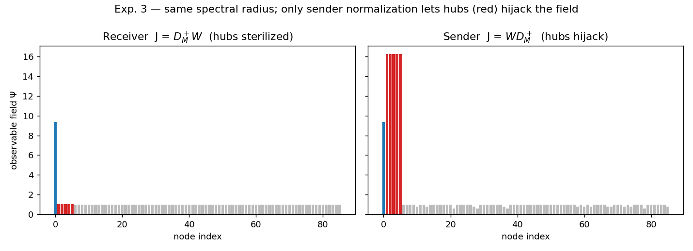
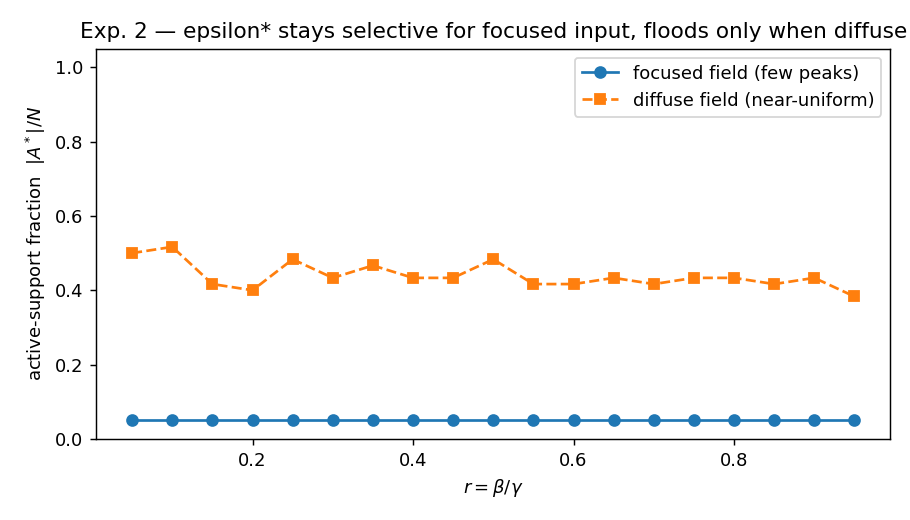

# TSSC — Foundational Experiments

Reference implementation of the **baseline numerical claims** in the paper

> **Filippo Cosci — *Meaning as a Field Event: the Theory of the Continuous Semantic Space (TSSC)*** *(Il significato come evento di campo — Teoria dello Spazio Semantico Continuo)*

The PDF (Italian and English) lives in [`paper/`](paper/).

## Scope — please read

This repository reproduces the **five foundational experiments** that the paper
states as already established. It is **not** the full simulation. The paper
itself (§11.5) names the complete *Toy Model* — exercising the whole life-cycle
of a perturbation (source → propagation → observable field → active support →
suppression → cut tension → parametric transformation → mitosis / gap genesis)
— as the **immediate next step**. What is here is the algebraic and dynamical
core those experiments rest on, packaged so that a reader who arrives from the
paper can run the basics and verify them.

| # | Experiment | Paper section | What it checks |
|---|------------|---------------|----------------|
| 1 | `exp1_epsilon_identity` | §5.7 | $\varepsilon^*(X) = \frac{\Vert X \Vert_2^2}{\Vert X \Vert_1} = \bar{x}(1+\text{CV}^2)$ holds to machine precision |
| 2 | `exp2_selectivity` | §5.7, §8.10 | $\varepsilon^*$ stays selective for a focused field across all $r = \beta/\gamma$; floods only when the field is genuinely diffuse |
| 3 | `exp3_hub_hijacking` | §9 | Receiver coupling $J = D_M^+ W$ → hubs sterilized (0/5); sender coupling $W D_M^+$ → hubs hijack the field (5/5), at the **same spectral radius** |
| 4 | `exp4_contraction` | §9, §9.1 | $\Vert J \Vert_\infty \le 1$ under $\vert w_{ij} \vert \le m_{ij}$, so $\beta < \gamma$ suffices for contraction |
| 5 | `exp5_als_disjoint` | §8.2.4, §8.2.6 | Weighted rank-1 ALS descends monotonically; disjoint-support cross-template has an exactly zero diagonal |

## Visuals & Results

All generated plots and experiment outcomes are saved in the [`figures/`](figures/) directory. Here is a brief preview:

<div align="center">
  
  
  <br/>
  <em>Left: <b>Exp 3</b> shows how receiver-coupling prevents central hubs from hijacking the field. Right: <b>Exp 2</b> demonstrates the self-adapting, scale-invariant behavior of the semantic threshold &epsilon;<sup>*</sup>.</em>
</div>

## Install

```bash
python -m venv .venv && source .venv/bin/activate
pip install -r requirements.txt
```

Requires Python ≥ 3.9, `numpy`, `matplotlib`; `pytest` for the test suite.

## Run

Run every experiment (prints the numbers, writes the figures to `figures/`):

```bash
python run_all.py
```

…or a single one:

```bash
PYTHONPATH=. python experiments/exp3_hub_hijacking.py
```

Run the test suite (asserts every claim above):

```bash
PYTHONPATH=. pytest -q
```

## What you get

Each experiment is a small, dependency-light script that (a) prints a short
report with the key numbers, (b) returns a plain function the tests import, and
(c) saves a figure under `figures/`. The shared primitives live in
[`tssc_core/`](tssc_core/__init__.py) and are each a direct transcription of an
equation in the paper — `epsilon_star`, `active_support`, `receiver_coupling`,
`field_step`, `rank1_als_weighted` — with the paper section cited in the
docstring.

The tests are **property / identity tests** (machine-precision equalities,
bounds that must never be violated, results reproduced across random seeds),
not brittle golden-number snapshots: they stay meaningful if `tssc_core` is
refactored.

## Honesty notes

- Experiment 3 isolates *concentration* from *instability* by rescaling the
  sender coupling to the **same spectral radius** as the receiver coupling
  before comparing. The 0/5 vs 5/5 split is therefore an effect of the
  normalization direction, not of one operator simply being "bigger".
- Experiment 2's "flood" / "selective" thresholds are reported, not tuned to
  flatter the theory; the figure shows the full curve so you can judge.
- These experiments validate the **operators**, not the emergent cognitive
  claims (working-memory capacity, concept formation on real corpora). Those
  need the Toy Model and real data, and are explicitly future work.

## Contact

- Email: tssc.ai@proton.me
- Paper: see [`paper/`](paper/)

## License

Code released under the MIT License (see [`LICENSE`](LICENSE)).
The paper text is © Filippo Cosci; see the paper for its own terms.
